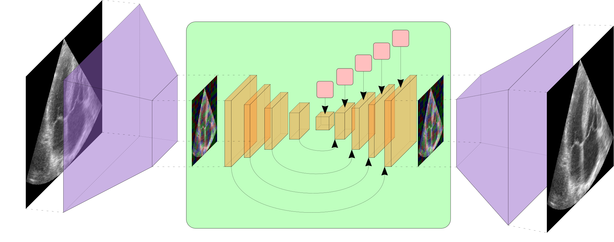

# [Efficient Semantic Diffusion Architectures for Model Training on Synthetic Echocardiograms](https://arxiv.org/abs/2409.19371)&middot; [](http://makeapullrequest.com) [](https://github.com/your/your-project/blob/master/LICENSE)<br><sub>Official PyTorch implementation </sub>

  

[David Stojanovski](https://scholar.google.com/citations?user=6A_chPAAAAAJ&hl=en), [Mariana da Silva]([https://scholar.google.com/citations?hl=en&user=6DkZyrXMyKEC](https://scholar.google.com/citations?user=0JWm1t0AAAAJ&hl=en)), [Pablo Lamata](https://scholar.google.com/citations?hl=en&user=H98n1tsAAAAJ), [Arian Beqiri](https://scholar.google.com/citations?hl=en&user=osD0r24AAAAJ&view_op=list_works&sortby=pubdate), [Alberto Gomez](https://scholar.google.com/citations?hl=en&user=T4fP_swAAAAJ&view_op=list_works&sortby=pubdate)

## Data and pretrained models


The data and models can be downloaded [here](https://zenodo.org/records/13887046).

Alternatively the data can be directly downloaded using the following commands via
terminal:

```bash
wget -P ./data https://zenodo.org/records/13887046/files/generated_data.zip
```

The pretrained models can directly downloaded using the following commands via terminal:

```bash
wget -P ./trained_models https://zenodo.org/records/13887046/files/trained_models.zip
```

## Requirements

* Python libraries: See [environment.yml](./environment.yml) for library dependencies. You can use the following
  commands with Miniconda3 to create and activate your Python environment:

```bash
conda env create -f environment.yml -n edmxl && conda activate edmxl
```

## Getting started

### Config Files

All models (diffusion, VAE, and downstream tasks) have their own config files located in [./configs](./configs).
The config files are in an EasyDict format and contain all the hyperparameters for the models. These parameters act as
the default values in all training/testing scripts, but can be overwritten by passing the desired parameters as command
line arguments. The help message for all the parameters can be found in the respective training/testing scripts argument
parser.

## Training new models

For each of the different models we have a separate script to train and test the models. The scripts are located
in [./bash_scripts](./bash_scripts).

### Diffusion Model

The diffusion model code can be regarded as functionally the same as the
original [EDM github](https://github.com/NVlabs/edm) (with a sizeable refactor and some quality of life improvements),
along with the ability to use a semantic map conditioning via the SPADE normalisation.

A VAE model can be loaded into the code if generated from the supplied VAE training script, and given the corresponding
config file and model-weights path. e.g. for a config file located at
`/home/nobel_prize_work/configs/EDM-L64_DIFFUSION_CFG.py` the diffusion code will load this config file and then attempt
to load the VAE model weights from the `__C.DATASET.LOAD_VAE_MODEL_PTH` variable in the diffusion model config file.

E.g. to train an EDM style diffusion model with a 64x64 VAE on 6 GPUs and 10 threads, the following command can be used:

```bash
OMP_NUM_THREADS=10 torchrun --standalone --nproc_per_node=6 /path/to/train_diffusion.py --config=/path/to/vae_config.py --arch=adm --precond=edm
```

The bash script for training the diffusion model is located
at [./bash_scripts/train_diffusion.sh](./bash_scripts/train_diffusion.sh).

A bash script to generate all `EDM` and `EDMLX` diffusion model samples is located
at [./bash_scripts/generate_diffusion_images.sh](./bash_scripts/generate_diffusion_images.sh).

The bash scripts can be modified to generate the `VE` and `VP` models by changing the sampling parameters used as
arguments to the `generatev2.py` script.

### Downstream Tasks (classification and segmentation)

The downstream tasks only require the corresponding config files to be passed as arguments to the python scripts. E.g.
to minimally train a classifier (assuming a correctly populated classification config file):

```bash
python /path/to/train_classification.py --config=/path/to/classification_config.py
```

Subsquently, to test a segmentation model:

```bash
python /path/to/test_segmentation.py --config=/path/to/segmentation_config.py
```

## Example Images

  

## Acknowledgments

We would like to acknowledge the previous authors of the VE, and VP models, and in particular the authors of the EDM
models for their work and codebase.

The original EDM codebase can be found [here](https://github.com/NVlabs/edm).

## Future Work

While this paper was being worked on (among other as yet unpublished work), the authors of the EDM codebase released a
new version of the codebase, which includes a number of improvements and new features. This has been named EDM2 and can
be found [here](https://github.com/NVlabs/edm2). I don't think there is a reason why combining the EDM2 improvements
with the semantic diffusion method would not be possible, and would likely be beneficial. However, this is left as
future work for somebody else to explore (I will not personally be undertaking this anytime soon).

## Cite this work [Arxiv]

```
@misc{stojanovski2024efficientsemanticdiffusionarchitectures,
      title={Efficient Semantic Diffusion Architectures for Model Training on Synthetic Echocardiograms}, 
      author={David Stojanovski and Mariana da Silva and Pablo Lamata and Arian Beqiri and Alberto Gomez},
      year={2024},
      eprint={2409.19371},
      archivePrefix={arXiv},
      primaryClass={eess.IV},
      url={https://arxiv.org/abs/2409.19371}, 
}
```

